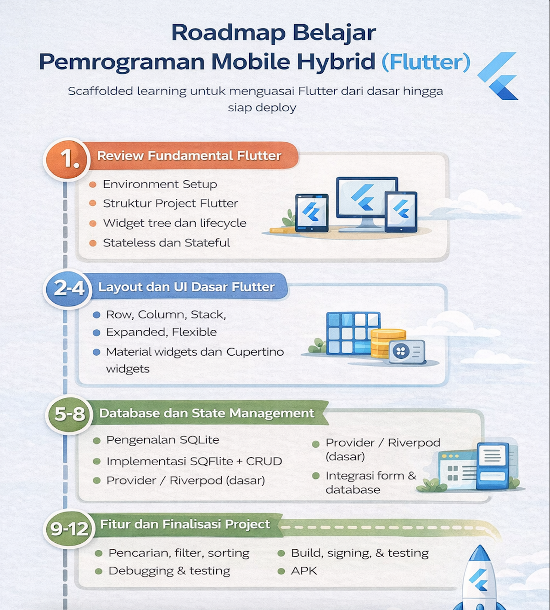

# 📱 Modul Pemrograman Mobile Hybrid (Flutter)

Modul ini digunakan sebagai panduan pembelajaran mata kuliah **Pemrograman Mobile Hybrid (Flutter)**.  
Materi disusun secara bertahap mulai dari **review fundamental**, **pembuatan UI**, **integrasi database**, hingga **build aplikasi** sehingga mahasiswa mampu mengembangkan aplikasi mobile Flutter secara mandiri.

---

## 🎯 Tujuan Pembelajaran

Setelah mempelajari modul ini, mahasiswa diharapkan mampu:

1. Menyiapkan dan mengonfigurasi environment Flutter.
2. Mengimplementasikan widget dan layout dasar Flutter.
3. Membangun navigasi dan form input dengan validasi.
4. Mengintegrasikan database lokal (SQLite) ke dalam aplikasi.
5. Mengelola state aplikasi menggunakan Provider/Riverpod dasar.
6. Mengimplementasikan fitur tambahan (search, filter, sorting).
7. Melakukan debugging, testing, serta build APK.

---

## 🧩 Prasyarat

Sebelum menggunakan modul ini, mahasiswa harus:

- Telah menempuh mata kuliah **Dasar Flutter**
- Memahami dasar pemrograman (variabel, kondisi, perulangan, fungsi)
- Memiliki laptop dengan OS Windows/Mac/Linux

---

## 🛠 Tools & Software

- Flutter SDK
- Android Studio / VS Code
- Android Emulator atau perangkat fisik
- Git

---

## 📚 Struktur Modul

Modul dibagi menjadi beberapa bagian utama:

### 1. Review Fundamental Flutter

- Environment setup
- Struktur project Flutter
- Widget tree & lifecycle
- Stateless & Stateful Widget

### 2. Layout dan UI Dasar

- Row, Column, Stack
- Expanded, Flexible
- Material & Cupertino widgets
- Theming dan styling

### 3. Navigasi dan Routing

- Navigator push/pop
- Named routes
- Passing data antar halaman

### 4. Form dan Validasi Input

- TextFormField
- Controller
- Validation rule

### 5. Konsep Database Lokal

- Pengenalan SQLite
- ERD
- Relasi tabel

### 6. Implementasi Database (SQFlite)

- Model class
- Database helper
- CRUD operations

### 7. State Management Dasar

- Provider / Riverpod
- Data binding
- UI refresh

### 8. Integrasi Form dengan Database

### 9. Fitur Tambahan

- Search
- Filter
- Sorting

### 10. Debugging & Error Handling

### 11. Testing Dasar Flutter

### 12. Build, Signing, dan Packaging APK

### 13. Dokumentasi & Presentasi Aplikasi

---

## 🗺 Roadmap Pembelajaran




---

## 📂 Struktur Folder Repository (Contoh)

```bash

flutter-module/
│
├── materials/
│ ├── 01-fundamental/
│ ├── 02-layout-ui/
│ ├── 03-navigation/
│ ├── 04-form-validation/
│ ├── 05-database-concept/
│ ├── 06-sqlite-implementation/
│ ├── 07-state-management/
│ ├── 08-integration/
│ ├── 09-feature/
│ ├── 10-debugging-testing/
│ └── 11-build-apk/
│
├── assets/
│ └── roadmap_flutter.png
│
└── README.md

```

---

## 📝 Metode Pembelajaran

- Ceramah singkat
- Demo
- Praktikum terarah
- Diskusi
- Studi kasus

---

## 📌 Aturan Umum

- Setiap pertemuan terdapat latihan/praktikum.
- Tugas dikumpulkan sesuai deadline.
- Plagiarisme tidak diperbolehkan.
- Mahasiswa dianjurkan menggunakan Git untuk version control.

---

## ✅ Hasil Akhir yang Diharapkan

Mahasiswa mampu menghasilkan:

- Aplikasi Flutter sederhana yang berjalan
- Terintegrasi database lokal
- Memiliki fitur input, tampil data, edit, dan hapus
- APK siap dijalankan

---